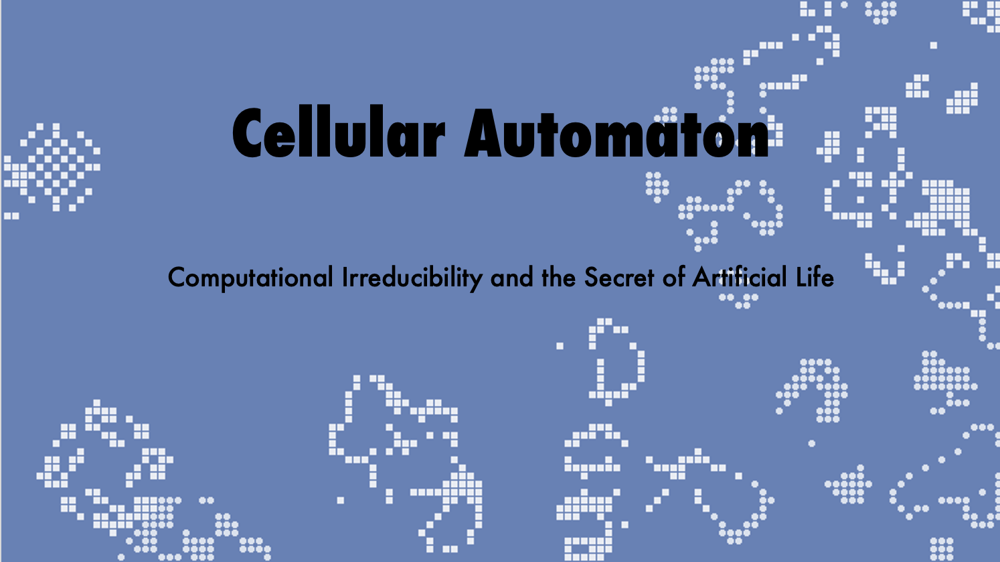

title: Cellular Automata and Genetics
date: 2021-11-18
description: Conways Game of Life paired with a genetic algorithm, produces irreducible complexity with evolution.

[Github Here](https://github.com/benlongcroft/GameOfDNA)

This project spawned off me becoming more and more interested with cellular automata and concept of irreducible complexity. It then became an artefact for an interview 'show and tell' and formed the basis of a presentation I gave on Cellular Automata and the secret to artificial life. 

I started by building a simple version of Conways Game of Life using Java AWT. I found this relatively interesting to start with and was playing around with various starting configurations. After a few conversations with others about it, the question was provoked of how this could be played with? I was interested with evolutionary algorithms and recalled a friend playing with the ant pheromone algorithm to solve Travelling Salesman problems. From this, the idea spawned to assign genetic information to each cell.

This was done via a class that contained colour values for each cell. The rules were similar to Conways game of life in that:

1.  If a live cell has more than 3 neighbours, it will die
2.  If a live cell has less than 2 neighbours, it will die
3.  If a live cell has exactly 3 neighbours,
	- Find a nearby cell that is 'similar' 
	- That mate finds a suitable location for the child (empty cell with 3 neighbours)
	- Insert child into location with half of each parents genome

This process had some interesting variables. The criteria for choosing a mate produced some different results. Choosing a similar mate resulted in one indeterminable colour group from dominating. Choosing the most opposite mate (those with the most differing colour value) resulted in a deadlock. Using the midpoint of each parents genome or 50% of either parents genome also resulted in interesting phenomena, Using the midpoint converged on a single colour group much faster than using 50% of either.

While this was an interesting project to play around with, and while there is certainly more that could be done and experimented with, it was difficult to produce results that didn't simply converge on one random colour group. There was no selective pressure other than achieving as much grid space as possible which seemed to provide the cells with this exact aim, without such an aim ever having being programmed. That, for me was the most interesting phenomena of this project. 