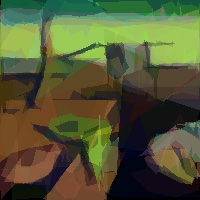
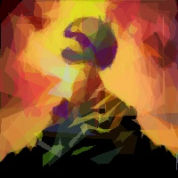
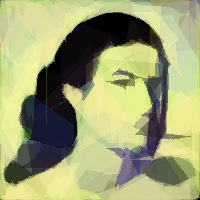
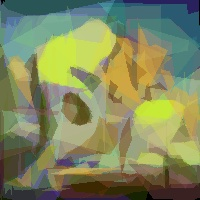
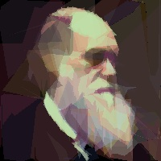
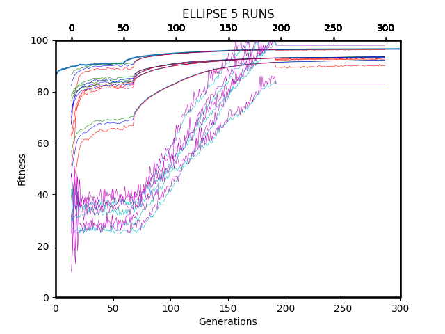

title: Abstract Art through Evolution
date: 2022-05-04
description: Using EVOL to develop polygon based abstract art

These images above were rendered using 840 fitness evaluations in my genetic algorithm that tried to represent a target image of 200x200 into a vector based image using polygons.. I really enjoyed learning about biocomputing, partially due to my brief project playing with the idea of genetics within entities (see Game of DNA)

I also had to write a 2500 word report about my findings, during which I learnt LATEX - LATEX makes writing essays actually really enjoyable and I thought I would add a few snippets from my report in here to elucidate some of my findings and troubles while building this piece of software. I used EVOL (a heuristic genetic pipeline library in Python) and PIL (the Python Imaging Library) to generate these images, alongside a fair amount of randomness from the python random library. 

Here was the abstract from my paper. 

*The aim of this paper was to explore the accuracy of evolutionary algorithms to ’draw’ target images with under 100 polygons. Experimentation was done to explore the effects of various solution representations, offspring generation strategies and selection methods against the most successful algorithm that produced the images shown above. This was achieved by exploring the bounds of the solution representation, ensuring granular, small mutations from generation to generation and by optimising parameters within generational structures. Overall, we can see the powerful effect of evolution to solve heuristic problems limited solely by time, solution search space and scale influenced by the im- portance of selection, individual and small mutations and proper visualisation tools to develop successful evolution-based solutions.*

Some results...

The Magenta and Cyan lines represent the number of polygons in the best and worst canvases respectively. The red, blue and green lines represent the worst, median and best fitness scores of the individuals respectively. The aim was to achieve 95% fitness on most images with varying random seeds and this graph is from 5 different images, with different seeds using 4 concurrent workers per run. As you can see, the worst fitness score achieved was 94% which I will take as success.

*Prior to this project, I had no experience developing bio-inspired algorithms and I was struggling initially to get to grips with the problem. I had to overcome logical errors causing inconsistent results and inaccurate experimentation before obtaining reliable results that could be presented here. While there are still many aspects of this solution that could be optimised, such as the ranges of mutation functions, recombination and alpha value - the results presented here show the effectiveness of evolution in producing polygon-based images. Future work could be done to experiment with different solution representations, however it appears that the most effective shape to represent images is a polygon due to the larger search space provided by mutating different points. Further experiments with higher resolution images would be particularly interesting in seeing how this solution scales with target image size and with a larger number of polygons. This task provided me with a deeper knowledge of the evolution-process and high- lighted the important factors in producing a successful evolution based algorithm as well as improving my skills in conducting fair and scientific inquiries into optimisation prob- lems. Despite not having much knowledge of bio-computing before this project and strug- gling initially due to logical errors and faulty experimentation, I managed to produce a successful algorithm that works on a variety of image sets.*