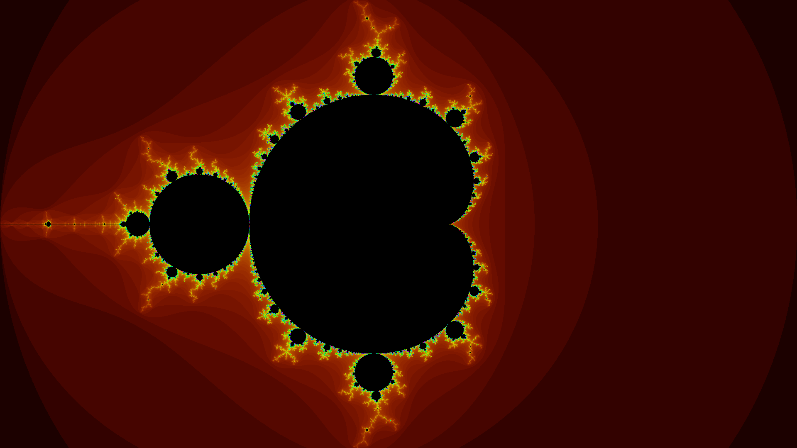

title: Fractal Rendering Engine
date: 2021-09-15
description: A small project developed for fun playing with Mandelbrot set visualisations.

[Github Here](https://github.com/benlongcroft/FractalRenderer)

I decided to start this project after getting into a wikipedia hole about Mandelbrot sets and the nature of fractals. I found them to be really interesting and wanted to have a go building my own fractal rendering engine. I decided to do this with Java AWT/Swing as it was a library I had been playing around with for university anyway, and something I wanted to improve my skills in so that I might become more versed in building desktop applications using Java. AWT/Swing is a cool library because it really does make building desktop apps super easy. Java being a cross-platform language thanks to JVM also allows this app to run on any host (although I haven't tried it on windows yet)

The maths for a Mandelbrot set is relatively simple and there are hundreds of tutorials to build a simple black and white Mandelbrot set. What I wanted to do to make it interesting was to build visualisations that could zoom to develop videos, as well as use some interesting colouring schemes by playing with parameters. This was relatively simple as the colours can be adjusted using RGBA easily and based on the escape point, be coloured with different values. 

<video width="500px" height="500px" 
        controls="controls" style="display: block; margin: 0 auto;"/> 
        <source src="../../static/blog-images/FractalRendering2.mov" 
            type="video/mp4"> 
</video> 

As you can see from the video above, the main issue I encounter is anti-aliasing issues due to the resolution of the image. This can be reduced by the number of steps needed but the sharpness of the video above I think is pretty cool. Given more time, I might also slow this down by introducing more frames as the zoom happens really quickly in the above image. The reason I can't go any further than this is because after a while, the number of decimal points held is too large and the zoom can't continue. I'm sure there might be some clever solution to hold more decimal points to get a deeper zoom but this sufficed for me.

