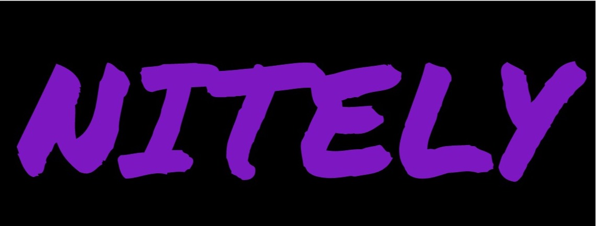
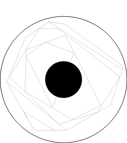

title: Nitely Update
date: 2021-12-12
description: An update on a longstanding project that won't be progressing.

Nitely started as a project to pass some time during lockdown and it really snowballed and turned into something that taught me a lot of important lessons and skills. The concept was to produce a machine learning based tool that could recommend nights out, not simply a single venue but multiple venues over the course of an evening to build a whole 'night out'. I started it in lockdown after hearing about how much trouble the hospitality industry would be in post-covid and I thought that it might help, as well as providing an interesting project to fill my time. 

It utilised NLP with spaCy, Google Places API as well as an eclectic set of data sources that allowed me to process data on a nightclubs, bars and restaurants in Newcastle. This data was difficult to find initially and even more of a pain to wrangle into a common format however, once I did - I could use the NLP powers of spaCy to parse for keywords, themes and other data to process. This helped build dictionaries of words with spatial mappings to the nightclub entities. 

Each club was represented via a multidimensional vector (300) that could be mapped spatially other venues to look for similarities. This was through an algorithm called K2K which I devised and uses keyword mapping and dimensionality reduction to produce these vectors, store them and compare them against user vectors - generated from user preferences and choices while using NITELY. This was paired with shortest path heuristics to ensure that venues were not only similar in atmosphere, but also in distance. 

This was all great at first, however I soon ran into some heavy processing costs in order to run this on a large scale as well as API costs and server hire which prevented this project from progressing any further. This was a blow but I think by this point I needed a break from NITELY too, I had been working on it for well over a year and it was good to step back and take some time to think about other projects (especially those with *some* financial incentive!) 

All the code is available to see on GitHub [here](https://github.com/benlongcroft/Nitely-Code-Base) and if you feel you have any ideas or changes please don't hesitate to let me know! It's a project I may come back to for a complete rethink in the future, but one that for the moment needs to sit for a while so I can reconsider the important aspects and maybe build some capital to run it in a cost-efficient way. 