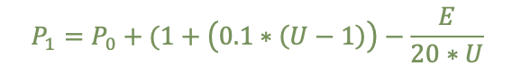
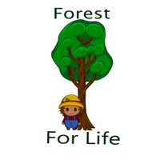

title: Sonnys Forest
date: 2022-01-21
description: 2D Unity Game educating on the dangers of climate change.

[Play Here](https://simmer.io/@Team_22/sonny-sforest)

[Github and Source Code](https://github.com/benlongcroft/Sonny-sForest)

Sonny's Forest is a 2D unity game educating on the dangers of climate change. It was built as part of a second year software engineering module with Newcastle University. This game was primarily built by me, but with some help from [v3yn](https://github.com/v3yn). The graphics were bought from the unity asset store and can be purchased [here](https://assetstore.unity.com/packages/2d/environments/2d-isometric-starter-standard-kit-svg-118014). The Sonny character was designed by a member of my team.

The game dynamics of this game were a lot of fun to build. I especially enjoyed fiddling with the pollution controls, which was modelled by an equation I devised based on expected gameplay. This uses the number of fields unlocked and the total  sum efficiency of the forest to calculate the next pollution state, and this is updated every second using a generator tick. This was better than updating with each frame as it meant less computation and ensured the game remained frame-rate independent. 

The stages a tree can be have different overall effects on the trees ability to reduce pollution. Younger trees are less efficient than older trees, each stage has its own amount of time spent at that stage. The stage also effects the seed drop rate which, in turn affects the ability of the player to unlock more fields as the user needs seeds, to buy coins, to buy more fields.

This eludes to one of the largest failings of this game that could be adjusted in future versions, if the user simply remains in the starting field indefinitely - pollution will never catch up with them - allowing Sonny to live eternally! While this is an issue in my defence, who plays a game only to live safely? Despite that, there is lots of room for improvement on this game. Not least from introducing secondary modifiers such as diseases, fertilisers, pesticides, bandits etc. but also from circumstantial elements such as weather. 

Sonny's Forest was built within a cramped frame time almost solely by me, it also was the first unity game I had ever built and my first time developing with C# (although my Java experience helped with this). It was a sharp learning curve and I encountered issues with git workflows, team management and a whole host of issues getting to grips with unity. Despite this, it provides a base for future work in educating on the dangers of climate change and much room for improvement. 
